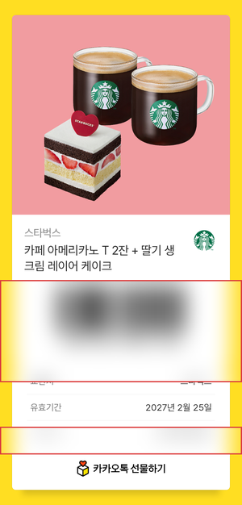
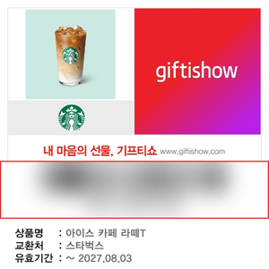
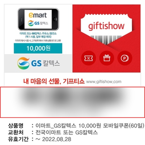
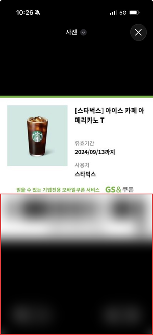
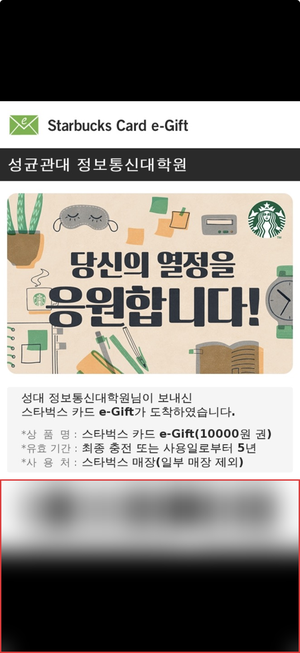
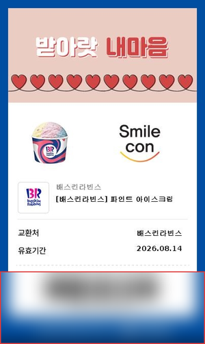
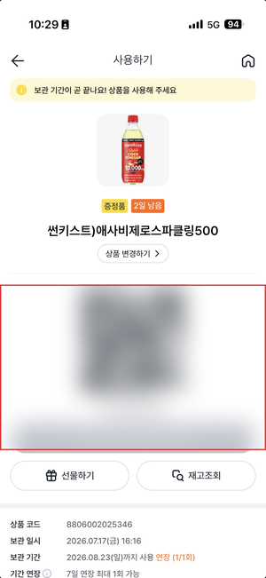
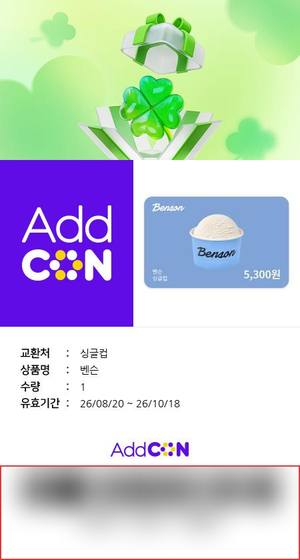
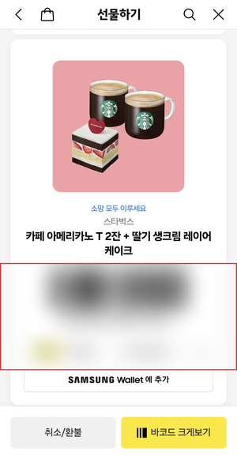
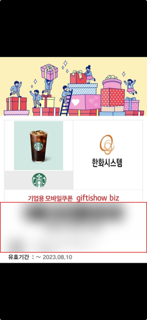

# 기프티콘 유형과 판단 기준

출시 전에 "무엇까지 받아들이는가"를 한자리에 적어둔다. 실물로 확인한 유형, 그것을
가르는 기준(숫자와 규칙), 그리고 각 경우에 무엇이 나와야 하는지다.

지금은 받아들이는 쪽으로 최대한 밀어붙여서 규칙이 여럿 겹쳐 있다. **나중에 일부를
포기하고 단순하게 되돌릴 수 있게**, 각 규칙마다 "이걸 빼면 무엇을 잃는지"를 같이 적는다.

- 정리 시점: 2026-08-21
- 자동 시험: `client/src/test/` (25개 파일, 174개)

---

## 1. 실물로 확인한 유형

바코드와 주문번호는 가렸다. 아직 쓸 수 있는 기프티콘이라 그림만으로 결제되면 안 된다.
가리는 스크립트는 `scripts/mask-gifticon.py`에 있다 — 막대가 있는 가로 띠를 스스로 찾아
흐리게 만든다(`gallery.js`의 `looksLikeBarcode`와 같은 규칙이다).

| | | | |
| --- | --- | --- | --- |
| <br>**1. 카카오톡 원본**<br>800×1670 · 줄여서 읽음 | <br>**2. 기프티쇼 정사각**<br>450×450 · 원본 크기로 | <br>**3. 기프티쇼 (이마트·GS칼텍스)**<br>450×450 · 금액권 | <br>**4. GS&쿠폰**<br>폰 캡처 · 위아래 검은 여백 |
| <br>**5. 스타벅스 카드 e-Gift**<br>기한이 "5년"이라 빈칸 | <br>**6. 카톡이 줄인 배스킨**<br>404×677 · **못 읽음** → 서버가 숫자를 | <br>**7. 편의점 QR**<br>`IX;1;…;;` 껍데기째 다시 그림 | <br>**9. AddCON 상품권**<br>상품명이 상호로 새던 카드 |
| <br>**10. 선물하기 캡처**<br>읽힘. 대표는 원본에 양보 | <br>**기프티쇼 biz**<br>3번과 같은 갈래 | | |

**8. 글자만 있는 쿠폰(파인트)**과 **12. 목록 화면 캡처**는 그림이 없다. 채팅으로 받은
사진이 디스크에 안 남았다. 8번은 이번 작업(2-5)의 이유가 된 유형이라 있으면 좋다.

| # | 유형 | 크기 | 브라우저가 바코드를 | 실제 결과 |
| --- | --- | --- | --- | --- |
| 1 | 카카오톡 원본 카드 | 800×1670 PNG | 읽음 (0.96~0.45로 줄여서) | ✅ |
| 2 | 기프티쇼 정사각 카드 | 450×450 | 읽음 (원본 크기) | ✅ |
| 3 | 기프티쇼 가로형 (이마트·GS칼텍스) | 450×330 | 읽음 | ✅ |
| 4 | GS&쿠폰 세로형 | 430×600 | 읽음 | ✅ |
| 5 | 스타벅스 카드 e-Gift | 662×1200 | 읽음 | ✅ 기한만 빈칸 |
| 6 | 카톡이 줄여 보낸 배스킨 | 404×677 | **못 읽음** (막대가 1.4px) | ✅ 서버가 인쇄된 숫자를 읽음 |
| 7 | 편의점 QR | 폰 캡처 | QR로 읽음 | ✅ |
| 8 | 글자만 있는 쿠폰 (파인트) | 폰 캡처 | **못 읽음** (바코드가 없음) | ✅ 서버가 쿠폰번호를 읽음 |
| 9 | AddCON 상품권 | 450×760 | 읽음 | ✅ (프롬프트 손본 뒤) |
| 10 | 선물하기 화면 스크린샷 | 1032×2000 | 읽음 | ✅ |
| 11 | 정보 캡처 (금액만) | 폰 캡처 | 못 읽음 (바코드가 없음) | 곁가지로 합침 |
| 12 | 목록 화면 통째 캡처 | 폰 캡처 | 읽음 (썸네일 속 막대) | **뺌** — 옆칸 값이 섞인다 |

### 유형별로 알아둘 것

**5. 스타벅스 카드 e-Gift** — 유효기간이 "최종 충전 또는 사용일로부터 5년"이라 날짜가
아니다. 기한이 빈칸으로 남고, 그러면 만료 알림이 안 간다. 등록 뒤 얼럿이 떠서 직접
채우게 한다. 카드번호와 핀번호가 둘 다 있는데 저장하는 번호는 하나다 — 매장에서는
바코드만 찍으면 되고 핀번호는 사진에 남아 있어서 칸을 따로 만들지 않았다.

**7. 편의점 QR** — QR 안에 값만 있지 않다. `IX;1;9816401685019;;` 같은 모양이다.
그림은 껍데기째 그대로 다시 그리고(리더기가 원본과 같게 읽어야 한다), 화면에 보여주는
번호만 벗긴다. 매번 새로 발급되는 일회용 QR은 저장해도 소용없다 — 이미지로 담는
서비스라 구조상 불가능하고, 논외로 둔다.

**12. 목록 화면 캡처** — 68px짜리 썸네일 안의 막대도 zxing은 읽어낸다. 번호는 맞지만
그 그림에는 다른 기프티콘이 같이 찍혀 있어서, 모델이 옆칸의 금액과 기한을 이 기프티콘
것으로 읽어온다(실제로 스타벅스 쿠폰에 BBQ의 26,500원과 2026.11.04가 들어갔다).

---

## 2. 판단 기준

### 2-1. 바코드를 읽는 배율 — `barcodeScaleLadder`

큰 쪽부터 줄여 가며 본다. 실측(2026-08-20, 카카오 카드 6장):

| 배율 | 결과 |
| --- | --- |
| 원본(1x) | 6장 전부 실패 |
| 2배 확대 | 6장 전부 실패 |
| 0.96~0.7 축소 | 4장 읽힘 |
| 0.45 축소 | 나머지 2장까지 전부 |

카드의 막대는 모듈이 4~5px에 경계가 뭉개져 있어서 원본 크기에서는 못 가른다. 줄이면
이웃 픽셀이 평균되며 다시 또렷해진다. **"확대가 살린다"가 오답이었다.**

> **빼면 잃는 것**: 카카오톡 원본 카드가 통째로 안 읽힌다. 뺄 수 없다.

### 2-2. 바코드가 사진에서 차지하는 폭 — `MIN_BARCODE_COVERAGE = 0.25`

이보다 작으면 "바코드를 보여주려고 찍은 사진"이 아니라고 본다. 목록 화면 캡처가 여기
걸린다(15% 안팎). 발행 카드는 0.45~0.59다.

> **빼면 잃는 것**: 옆칸 기프티콘의 금액·기한이 섞여 들어온다. 조용히 틀리는 쪽이라
> 빈칸보다 나쁘다. 뺄 수 없다.

### 2-3. 어느 사진을 대표로 보낼지 — `MIN_RICHNESS = 0.35`, `RICHNESS_TIE = 0.10`

그림이 얼마나 차 있는지(잉크 + 색)로 **순서만** 정한다. 실측:

| | 색 | 잉크 | 합 |
| --- | --- | --- | --- |
| 스벅 원본 | 0.436 | 0.587 | 1.023 |
| 같은 기프티콘 선물하기 캡처 | 0.160 | 0.344 | 0.504 |
| 기프티쇼 (원본 중 최저) | 0.253 | 0.472 | 0.725 |
| 바코드만 크게 띄운 캡처 | 0.03 | 0.031 | 0.06 |

**틀려도 사진을 버리지 않는다.** 순서만 바뀌고, 바코드가 제대로 찍힌 사진은 다 보낸다.
모델이 여러 장을 한 번에 보고 빈칸을 서로 채우므로 값이 사라지지 않는다.

버린 기준도 적어둔다 — 다시 넣지 않도록.
- **바코드 크기(coverage)**: 원본 0.477 vs 캡처 0.467. 안 갈린다.
- **우상단 모서리의 색**: 기프티쇼 카드는 오른쪽 가장자리가 세로로 전부 흰색이다.
  반대로 헤더가 노란 앱 화면을 캡처하면 그 자리가 색으로 찬다. 양쪽으로 뒤집힌다.

> **빼면 잃는 것**: 목록 카드에 크게 뜨는 그림이 스크린샷이 된다. 값은 안 틀린다.
> **포기해도 되는 축에 든다.**

### 2-4. 한 건에 넘길 사진 수 — `IMAGES_PER_CODE = 3`

같은 번호의 사진이 넷 이상이어도 셋까지만 저장하고 모델도 셋만 본다.

### 2-5. 못 읽은 사진의 정체 — 서버에 물어본다 ★

가장 늦게 들어온 규칙이고 가장 복잡하다.

브라우저가 바코드를 못 읽은 사진은 두 가지다. **그림만 봐서는 구분이 안 된다.**

| | 무엇 | 어떻게 해야 하나 |
| --- | --- | --- |
| 곁가지 | 같은 기프티콘의 정보 캡처 (금액만 적힘) | 그 건에 합침 |
| 딴 물건 | 바코드 없이 번호만 인쇄된 기프티콘 (파인트) | 별도 기프티콘 |

한때 "바코드가 없으면 곁가지"로 쳤다. 그러면 파인트가 스타벅스에 빨려 들어가서, 파인트의
상품명과 기한이 스타벅스 것으로 들어가고 파인트는 아예 없던 것이 됐다. 화면에는 멀쩡한
스타벅스 하나가 보인다.

번호가 인쇄돼 있는지는 서버가 읽어야 안다. 그래서 **한 장씩 물어본다.**

```
못 읽은 사진 → 서버에 물어봄
   · 번호 없음 → 곁가지 → 등록 폼으로. 사진 전부를 한 번에 보여준다
   · 번호 있음 → 딴 물건 → 다건 화면으로
```

**등록 창에서 묻는다**(`UploadSheet.acceptFiles`). 다건 화면으로 넘겨서 가리게 하면
후보를 각각 읽고 합쳐서 또 읽어야 해서 세 번이 든다. 여기서는 두 번이다.
후보가 이미 둘 이상이면 묻지 않는다 — 어차피 다건으로 가고 거기서 물어본다.

다건 화면에서도 못 읽은 사진을 후보로 세워 물어보고, 곁가지로 밝혀지면 접는다
(`GalleryScanSheet`의 `rescued` · `foldRescued`). 접을 때는 **합친 사진으로 한 번 더
읽는다** — 금액만 적힌 캡처를 혼자 보여주면 그게 무엇의 금액인지 몰라서 서버가 비워 온다.

> **빼면 잃는 것**: 바코드 없이 번호만 있는 기프티콘(파인트류)이 다건에서 사라지거나,
> 더 나쁘게는 옆 기프티콘에 섞여 들어간다. **값이 틀리는 쪽이라 빼기 어렵다.**
> 대신 "글자만 있는 기프티콘은 한 장씩 올려주세요"로 안내하고 규칙을 걷어내는 선택은
> 가능하다. 그러면 코드가 눈에 띄게 단순해진다.

### 2-6. 사진첩 훑기(자동스캔)에는 2-5를 적용하지 않는다

수백 장 중 바코드 없는 것마다 서버에 물으면 훑기 한 번에 하루 한도가 날아간다.
그래서 **자동스캔은 바코드가 읽히는 것만 찾는다.** 파인트류는 안 잡힌다 — 의도한 것이다.

---

## 3. 테스트 케이스

`+` 로 직접 고른 경우다. 자동스캔은 3-9 하나뿐.

| # | 올린 사진 | 나와야 하는 것 | 자동 시험 |
| --- | --- | --- | --- |
| 1 | 바코드 카드 1장 | 1건 | `groupImages` |
| 2 | 원본 + 같은 번호 스크린샷 | 1건, 사진 2장. 대표는 원본 | `groupImages` |
| 3 | 원본 + 정보 캡처 | **1건.** 등록 폼. 정보 캡처의 금액이 채워짐 | `UploadSheet` |
| 4 | 원본 + 스크린샷 + 정보 캡처 | **1건.** 등록 폼. 사진 3장. 금액 채워짐 | `UploadSheet` |
| 5 | 원본 A + 원본 B | 2건. 다건 화면 | `UploadSheet` |
| 6 | 원본 + 파인트(글자만) | **2건.** 다건 화면 | `UploadSheet` |
| 7 | 원본 A + 원본 B + 정보 캡처 | 2건. 정보 캡처는 **말없이 뺌** (붙일 곳을 모름) | `GalleryScanSheet` |
| 8 | 원본 + 배스킨(막대 뭉개짐) | 2건. 배스킨은 서버가 인쇄된 숫자를 읽음 | `GalleryScanSheet` |
| 9 | 사진첩 자동스캔 | 바코드가 읽히는 것만. 파인트류는 안 잡힘 | `GalleryScanSheet` |
| 10 | QR 카드 1장 | 1건. QR을 껍데기째 다시 그림. 번호는 벗겨서 보여줌 | `readableCode` |
| 11 | 만료된 카드 | 등록 막고 얼럿 | `UploadSheet` |
| 12 | 목록 화면 캡처 | 뺌 + "바코드가 너무 작게 찍힌 사진" 안내 | `GalleryScanSheet` |
| 13 | 이미 등록한 번호 | "이미 등록된 기프티콘이에요" | `GalleryScanSheet` |

### 실물로만 확인되는 것 (자동 시험이 못 잡는다)

캔버스와 zxing과 모델이 필요해서 시험에서는 흉내만 낸다. 배포 뒤에 손으로 봐야 한다.

- 카카오 카드가 실제로 읽히는가 (2-1의 배율)
- 서버가 인쇄된 숫자·쿠폰번호를 읽어내는가 (6·8번)
- 대표 사진이 원본으로 뽑히는가 (2-3)
- 매장 리더기가 다시 그린 바코드/QR을 읽는가 ← **아직 아무도 확인 안 함**

---

## 4. 출시 전 마지막 점검

- [ ] 3·4번(원본 + 정보 캡처)에서 **금액이 채워지는지** — 두 번 깨졌던 자리다
- [ ] 6번(원본 + 파인트)에서 **2건으로 나뉘는지**
- [ ] 매장에서 실제로 결제되는지 — 바코드 한 번, QR 한 번
- [ ] 자동스캔이 예전처럼 도는지

## 5. 나중에 단순하게 되돌릴 때

복잡한 순서대로 적는다. 위에서부터 걷어내면 코드가 눈에 띄게 준다.

1. **2-5 (못 읽은 사진 물어보기)** — 가장 복잡하다. 걷어내면 파인트류를 포기하는 대신
   `UploadSheet`의 물어보기, `GalleryScanSheet`의 `rescued`·`foldRescued`가 통째로 빠진다.
   안내는 "글자만 있는 기프티콘은 한 장씩 올려주세요".
2. **2-3 (대표 사진 고르기)** — 값이 틀리지는 않는다. 걷어내면 목록 카드 그림이 가끔
   스크린샷이 된다.
3. 2-1·2-2·2-4는 남긴다. 빼면 값이 틀리거나 아예 안 읽힌다.
