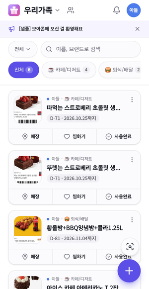

# 사진에서 기프티콘을 읽어내는 과정

사진 한 장이 기프티콘 한 건이 되기까지 무엇이 어떤 순서로 도는지, 각 자리에서 무엇을
쓰고 왜 그것을 골랐는지 적는다. 유형별 판단 기준은 [gifticon-cases.md](gifticon-cases.md)에
따로 있다 — 여기는 **읽는 방법**, 거기는 **가르는 기준**이다.

- 정리 시점: 2026-08-21

---

## 0. 큰 줄기 — 일을 둘로 나눈다

```
사진
 ├─ ① 막대를 읽는다      브라우저에서. zxing-js → (못 읽으면) zxing-wasm. 공짜
 └─ ② 글자를 읽는다      서버에서. 모델. 한 건에 6원
```

**나눈 이유는 값이다.** 사진첩을 훑으면 수백 장을 지나가는데 그중 기프티콘은 몇 장뿐이다.
전부 모델에게 보내면 한 번 훑을 때마다 수백 건 값이 나간다. 그래서 브라우저에서 공짜로
할 수 있는 일(막대 읽기, 이미 등록한 번호 거르기)을 먼저 하고, 거기서 살아남은 것만
서버로 보낸다.

값을 아끼려고 나눈 것이지 판독을 나눈 것이 아니다. 막대를 못 읽어도 ②가 인쇄된 숫자를
읽어줄 때가 있다(배스킨·파인트). 그래서 ①의 실패가 곧 탈락은 아니다.

---

## 1. 막대를 읽는다 — 브라우저, zxing

`client/src/utils/gallery.js`

### 왜 브라우저인가

zxing은 순수 자바스크립트로 돈다. 서버를 안 거치니 값이 0이고, 사진이 폰 밖으로
나가지도 않는다. 사진첩 훑기는 이 성질에 기대어 있다 — 수백 장을 브라우저에서 훑고
후보만 서버로 보낸다.

### 두 가지 판

| | 어디서 | 사다리 | 정밀 탐색 |
| --- | --- | --- | --- |
| **얕은 판** | 사진첩 훑기 | 1600 · 1150 · 750 | 안 함 |
| **깊은 판** | 직접 고른 사진, 훑기 뒤 재시도 | 1600 · 1150 · 900 · 750 · 640 | 마지막에 한 번 |

얕은 판이 약한 이유는 장수다. 수백 장을 지나가야 해서 한 장에 오래 못 머문다.
직접 고른 사진은 몇 장뿐이라 처음부터 깊은 판으로 본다.

### 배율 사다리 — 큰 쪽부터 줄여 간다

실측(2026-08-20, 카카오 카드 6장):

| 배율 | 결과 |
| --- | --- |
| 원본(1x) | 6장 전부 실패 |
| 2배 확대 | 6장 전부 실패 |
| 0.96~0.7 축소 | 4장 읽힘 |
| 0.45 축소 | 나머지 2장까지 전부 |

카드의 막대는 모듈이 4~5px이고 경계가 안티앨리어싱으로 뭉개져 있다. zxing은 그 뭉개진
경계를 원본 크기에서 못 가른다. 줄이면 이웃 픽셀이 평균되며 막대가 다시 또렷해진다.

**"확대가 살린다"고 믿고 2·3배를 돌리던 것이 오답이었다.** 수기등록이 7장 중 1장만 잡던
원인이 정확히 이것이었다(훑기는 1600에 맞추느라 우연히 0.96으로 줄여 읽었고, 정밀은
2배로 키워서 죽였다). 확대는 정말 작은 그림(450px 카드)을 위해 사다리 맨 뒤에만 남겼다.

줄이는 쪽이라 값도 싸다 — 캔버스가 작아지므로, 한 장이 전부 실패해도 얕은 판 0.2초,
깊은 판 0.6초다.

### 왜 tryHarder를 매번 켜지 않는가

zxing의 TRY_HARDER는 1차원 판독기를 맨 뒤로 미룬다. QR·DataMatrix·Aztec·PDF417을
먼저 뒤진 다음에야 막대를 보므로, 성공해도 300ms쯤 더 든다. 사다리 단마다 켜면 그 값이
곱으로 붙는다. 그래서 **사다리가 전부 실패했을 때 마지막에 한 번만** 켠다.

### 마지막 판 — zxing-wasm (2026-08-22)

**zxing-js가 아예 못 읽는 카드가 있다.** 실물 두 장으로 확인했다.

| 카드 | 크기 | 막대폭 | 막대 간격 |
| --- | --- | --- | --- |
| 스타벅스 부드러운 디저트 | 662×1440 | 93% | 11.9px |
| 스마일콘 배스킨 파인트 | 404×677 | 92% | 6.4px |

굵기는 넉넉하다. 그런데 이 둘에 대고 **다음을 전부 돌려도 빈손이었다.**

- 배율 사다리 전부(얕은 판 3단 · 깊은 판 5단 + tryHarder)
- 이진화 둘 — `HybridBinarizer`, `GlobalHistogramBinarizer`
- 막대 띠만 잘라내어 여백 0·15·40%로 두르고 0.7·1·2·3배 — 스물넷
- 형식을 `CODE_128`로 못박기, `Code128Reader`를 직접 호출

같은 파일을 **zxing-cpp는 원본 크기 그대로 40밀리초에 읽는다.** 배율이나 여백 문제가
아니라 판독기의 한계다. (한때 "가장자리까지 꽉 차서 quiet zone이 없다"로 보고 흰 여백을
둘러 다시 읽는 판을 넣었는데, 그것도 아니었다. 걷어냈다.)

그래서 **판독기를 둘 둔다.** zxing-js가 먼저 보고, 못 읽었는데 막대는 보이는 사진만
zxing-wasm(=zxing-cpp의 WebAssembly 빌드)으로 넘긴다.

**zxing-js를 걷어내지 않는 이유**는 지금 잘 읽히는 수백 장이 그것으로 읽힌 것이기
때문이다. 갈아치우면 그 수백 장이 전부 다시 시험 대상이 된다.

**값이 붙는 자리가 좁다.** 실물 훑기에서 쉰여덟 장 중 넷만 이 길로 왔다 — 밥 사진은
막대가 안 보여서 아예 지나가지 않는다. 판독 자체는 장당 40~50밀리초로 오히려 사다리
(200~600밀리초)보다 싸다.

wasm은 1MB라 **처음 필요할 때만 받아온다.** 앱을 열기만 하고 훑지 않는 사람은 내려받지
않는다. CDN이 아니라 앱에 같이 넣은 파일을 쓴다(인터넷 없이도 돌아야 한다).

여기서 읽은 건은 아래 검산을 건너뛴다. 배율만 바꿔 zxing-js에게 다시 물어봐야 어차피
빈손으로 돌아온다.

### 읽었다고 바로 믿지 않는다 — 검산

배율을 바꿔(`0.85배`) 한 번 더 읽는다. 두 번 다 같은 값일 때만 그대로 쓰고, 갈리면
확인 쪽을 택한다.

한 자리가 틀린 채 등록된 일이 실제로 있었다(7이 2로). ITF처럼 검산 자리가 없는 형식은
판독기 스스로 걸러내지도 못한다. 두 번째로 못 읽었다면 확인을 못 한 것이지만, 읽은 것은
읽은 것이라 그대로 쓴다.

### 막대가 사진에서 차지하는 폭 — `MIN_BARCODE_COVERAGE = 0.25`

읽힌 막대의 좌우 끝이 사진 폭의 몇 할인지 잰다. 발행 카드는 0.45~0.59, 목록 화면을
통째로 찍은 캡처는 0.15 안팎이다.

작은 것을 빼는 이유는 번호가 틀려서가 아니다. 68px짜리 썸네일 속 막대도 zxing은 읽어내고
번호도 맞다. 문제는 **그 그림에 다른 기프티콘이 같이 찍혀 있다**는 것이다 — 모델이 옆칸의
금액과 기한을 이 기프티콘 것으로 읽어온다. 실제로 스타벅스 쿠폰에 BBQ의 26,500원과
2026.11.04가 들어갔다.

### 못 읽었을 때 — 막대가 있기라도 한가

`looksLikeBarcode`. 읽는 것과 있는지 보는 것은 다른 일이다. 카톡이 404픽셀로 줄여 보낸
카드는 막대 하나가 1.4픽셀이라 어떤 배율로도 못 읽는데, 사람 눈에는 막대가 보인다.

밝기가 자주 뒤집히는 가로줄이 세로로 연달아 있고, **뒤집히는 자리가 위아래로 거의 같으면**
막대로 본다. 마지막 조건이 핵심이다 — 글자가 빽빽한 줄도 밝기는 자주 뒤집히지만 줄마다
자리가 다르다.

휴리스틱이라 줄무늬 옷이나 블라인드를 짚을 수 있다. **이 값으로 무엇을 지우거나 등록하지
않는다.** "여기 있을지도 모른다"고 말할 뿐이다.

### 한 번 아니라고 본 사진은 기억한다

훑기 기준선이 늘 설치일 0시라 매번 그 뒤의 사진을 처음부터 다시 본다. 한 번 확인한 것을
매번 다시 디코딩하면 쓰는 날이 길어질수록 훑기가 계속 느려진다. `NO_BARCODE_KEY`에
적어두고 건너뛴다. 사진 id는 재사용되지 않아서 남은 기록이 다른 사진을 가릴 일은 없다.

---

## 2. 글자를 읽는다 — 서버, 모델

`supabase/functions/analyze-gifticon/index.ts`

### 예전에 쓰던 것과 왜 버렸나

**tesseract(브라우저 OCR) + 정규식.** 두 가지가 안 됐다.

- **한글 인식이 자주 틀렸다.** 획 하나로 갈리는 글자를 흐린 캡처에서 읽어내지 못했다.
- **더 근본적으로, 읽은 글자 중 무엇이 상품명인지를 규칙으로 맞히는 일이 어렵다.**
  카드 생김새는 발행사마다 다르고 개편도 한다. 규칙을 하나 맞추면 다른 발행사가 깨진다.

그래서 **사진을 그대로 모델에게 보여주고 필요한 항목만 정해진 형식(JSON)으로 받는**
방식으로 바꿨다. 무엇을 찾느냐만 말하면 저쪽이 알아서 찾는다.

### 지금 쓰는 모델

| 자리 | 모델 | 값 | 왜 |
| --- | --- | --- | --- |
| 본 판독 | **`claude-haiku-4-5`** | 한 건 6원 | 금액·기한·상호는 숫자거나 아는 이름이라 이 정도로 충분하다 |
| 상품명 재확인 | **`claude-sonnet-5`** | 한 건 18원 | 상품명만 유독 틀린다 |

둘 다 시크릿으로 바꿔 끼울 수 있다(`ANALYZE_MODEL`, `ANALYZE_VERIFY_MODEL`).
코드에 박아두면 재볼 때마다 고치고 배포하고 되돌려야 해서 뺐다. **재보고 나면 반드시
되돌린다** — 시험하려고 켜둔 것이 그대로 남으면 값이 세 배가 된다.

### 왜 상품명만 따로 한 번 더 보는가

틀리는 항목이 상품명 하나로 몰려 있다. 금액·기한·상호는 숫자거나 아는 이름이라 하이쿠도
잘 읽는데, **상품명은 처음 보는 한글 덩어리라 획 하나로 갈린다.**



같은 카드를 두 번 읽어 나온 것이다 — **따먹는**, **뚜렛는**. 아래는 황금올리브 반반이
**황올밤**이 됐다. 틀린 방식이 조용해서 멀쩡한 이름처럼 저장되고, 목록에 나란히 놓이기
전까지는 아무도 모른다.

### 고려했다가 버린 것들

**모델에게 "확실하냐"고 물어 헷갈리는 것만 다시 보기** — `nameConfidence`를 함께 받아
헷갈림인 것만 재확인하려 했다. 그건 자기가 자기 답을 채점하는 것이다. 따먹는으로 읽었다는
건 그 순간 그렇게 보였다는 뜻이라 헷갈릴 이유가 없다. **틀린 줄 알면 애초에 안 틀린다.**
그래서 거르지 않고 전부 다시 본다.

**상품명 네모만 잘라 보내기** — 값이 3분의 1이라 좋아 보였는데, 좌표에 기대는 순간 조용히
망가지는 길이 열린다. 네모가 엉뚱한 데를 짚으면 이쪽은 거기 있는 글자를 정직하게 읽어오고,
그 값으로 갈아끼우면 **맞게 읽은 이름이 틀린 이름으로 덮인다.**

막아보려고 "앞서 읽은 이름과 너무 다르면 물리친다"를 넣었다가 걷어냈다. 못 믿는 쪽을 자로
삼는 셈이라, 하이쿠가 크게 틀릴수록 맞는 교정을 더 확실히 막았다. 게다가 "이쪽이 맞고
하이쿠가 많이 틀림"과 "네모가 딴 데를 짚음"은 둘 다 "크게 다름"으로 보여서 가를 수가 없다.

**사진을 통째로 주면 좌표가 아예 필요 없다.** 발행사마다 카드가 달라도 손댈 것이 없다.

**"상품명은 상호 옆이나 아래, 교환처 줄보다 위"처럼 자리를 알려주기** — 한 발행사의 배치를
규칙으로 굳히는 것이다. 무엇인지만 말하면 저쪽이 알아서 찾는다. 사람이 카드를 보고
"이게 받을 상품이구나" 하는 데 좌표가 필요 없는 것과 같다.

**thinking 끄기** — 답이 잘리는 것을 막으려고 껐더니 그 호출이 통째로 실패했다.
확인이 0.5초 만에 끝나고 모든 카드에 "상품명 재확인 못 함"이 붙었다. 되돌리고 천장만
2048로 올렸다. 실제로 쓴 만큼만 값을 내므로 올려도 비싸지지 않는다.

### 모델에게 보내는 사진

| | 값 | 근거 |
| --- | --- | --- |
| 긴 변 | **1568px** | 이미지 토큰은 픽셀 수로 매겨진다. 대략 115만 화소 또는 긴 변 1568을 넘기면 보내봐야 저쪽에서 다시 줄인다. 줄여서 손해 안 보는 가장 큰 값 |
| 품질 | **0.95** | 보관용은 0.82인데 그걸 모델도 같이 봤었다. 압축 자국이 획 위에 앉으면 다른 글자로 읽힌다 — 같은 사진이 부를 때마다 떠/따/뚜로 갈렸다. **화질을 올려도 요금은 그대로다** (토큰은 픽셀 수로만 매겨진다) |
| 장수 | 최대 5장 | |

세로로 긴 캡처는 이래도 폭이 700픽셀 언저리다. 화소 상한이 폭을 묶어버려서 더 넓힐
방법이 없다.

---

## 3. 못 읽은 사진의 정체를 가른다

브라우저가 막대를 못 읽은 사진은 두 가지고, **그림만 봐서는 구분이 안 된다.**

| | 무엇 | 어떻게 |
| --- | --- | --- |
| 곁가지 | 같은 기프티콘의 정보 캡처 (금액만 적힘) | 그 건에 합침 |
| 딴 물건 | 바코드 없이 번호만 인쇄된 기프티콘 (파인트) | 별도 기프티콘 |

번호가 인쇄돼 있는지는 서버가 읽어야 안다. 그래서 **한 장씩 물어본다.**

```
못 읽은 사진 → 서버에 물어봄
   · 번호 없음 → 곁가지 → 등록 폼으로. 사진 전부를 한 번에 보여준다
   · 번호 있음 → 딴 물건 → 다건 화면으로
```

자세한 것은 [gifticon-cases.md 2-5](gifticon-cases.md)에 있다.
**사진첩 훑기에는 하지 않는다** — 수백 장을 하나씩 물으면 하루 한도가 날아간다.

---

## 4. 값과 한도

### 어디서 몇 번 부르는가

| 올린 방식 | 서버 호출 |
| --- | --- |
| 한 장 | 1 (+ 상품명 재확인 1) |
| 원본 + 정보 캡처 | 2 (정체 확인 1 + 등록 폼 1) |
| 원본 + 파인트 | 정체 확인 1 + 다건 화면에서 2 |
| 다건 (바코드 N종류) | N |

상품명 재확인은 본 판독마다 한 번씩 따라붙는다. 한도를 따로 세는 이유가 그것이다 —
같은 통에 넣으면 한 건 등록에 두 칸이 닳는다.

### 한도

| | 지금 | 시크릿 |
| --- | --- | --- |
| 본 판독 1인 하루 | 30 | `ANALYZE_DAILY_LIMIT` |
| 본 판독 전체 하루 | 500 | `ANALYZE_TOTAL_DAILY_LIMIT` |
| 재확인 1인 하루 | 60 | `VERIFY_DAILY_LIMIT` |
| 재확인 전체 하루 | 1000 | `VERIFY_TOTAL_DAILY_LIMIT` |

한도를 세다 실패하면 **막지 않고 통과시킨다.** 한도는 요금 사고를 막으려는 장치이지
기능의 일부가 아니라서, 여기서 막으면 장애가 곧 서비스 중단이 된다.

출시 확정 뒤 1인 10 / 전체 200 / 한 달 6,000으로 낮출 계획이다
([store-release.md](store-release.md) 참고).

### 문지기

Supabase 기본값 `verify_jwt = true`는 **인증이 아니다.** anon key를 유효한 JWT로
받아주는데, anon key는 앱 번들에 그대로 들어 있어서 누구나 꺼낼 수 있다. 그대로 뒀으면
아무나 불러서 우리 돈을 쓸 수 있었다.

그래서 두 겹으로 막는다 — 진짜 로그인한 사용자인지 토큰으로 auth 서버에 물어보고,
그 사람이 오늘 얼마나 썼는지를 센다. 계정은 얼마든지 만들 수 있으니 인증만으로는 부족하다.

### 캐시

같은 번호를 다시 읽지 않는다. 열쇠는 **번호 + 사진 장수**다.

번호만으로 두면 같은 기프티콘에 정보 화면을 한 장 더해 올려도 예전 답이 그대로 나온다 —
새로 넣은 사진을 모델이 보지도 못한다. "금액 화면을 같이 올렸는데 금액이 안 채워진다"가
그래서 났고, 화면에는 사진이 세 장 멀쩡히 붙어 있어서 캐시를 의심하기 어려웠다.

---

## 5. 실패했을 때

| 어디서 | 어떻게 보이나 |
| --- | --- |
| 막대를 못 읽음 | 후보로 세워 서버에 물어본다(직접 고른 사진). 훑기에서는 안내만 |
| 서버도 번호를 못 읽음 | 카드에 "바코드 번호"가 빈칸으로 남는다. 직접 채울 수 있다 |
| 하루 한도 초과 | 서버가 보낸 말을 그대로 화면에 싣는다. 카드에서 **다시 읽기**로 재시도 |
| 상품명 재확인 실패 | 본 판독 값을 그대로 쓴다. 재확인은 있으면 좋은 것이지 없으면 못 쓰는 것이 아니다 |
| 사진을 못 여는 등 예외 | 그 한 장만 건너뛴다. 훑기 전체가 멈추지 않는다 |
